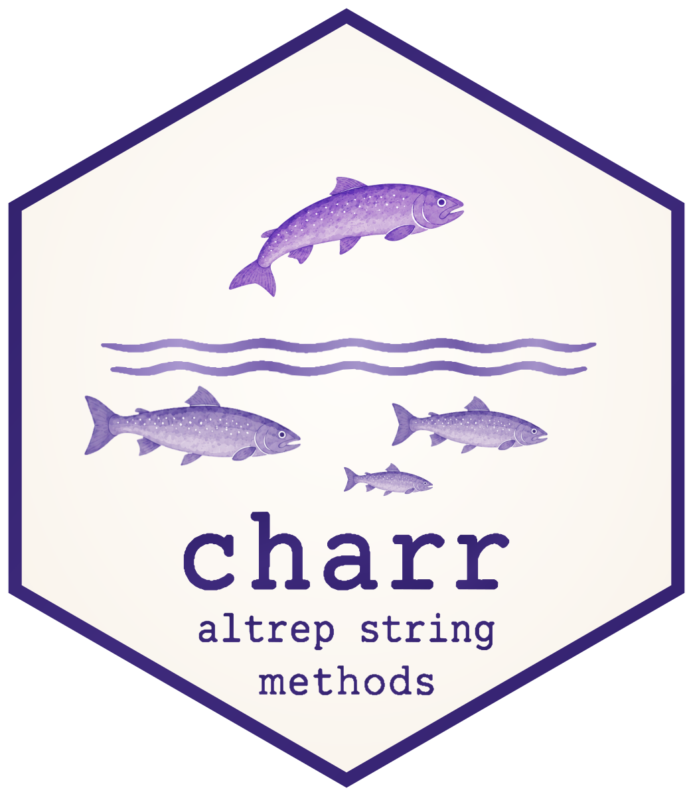
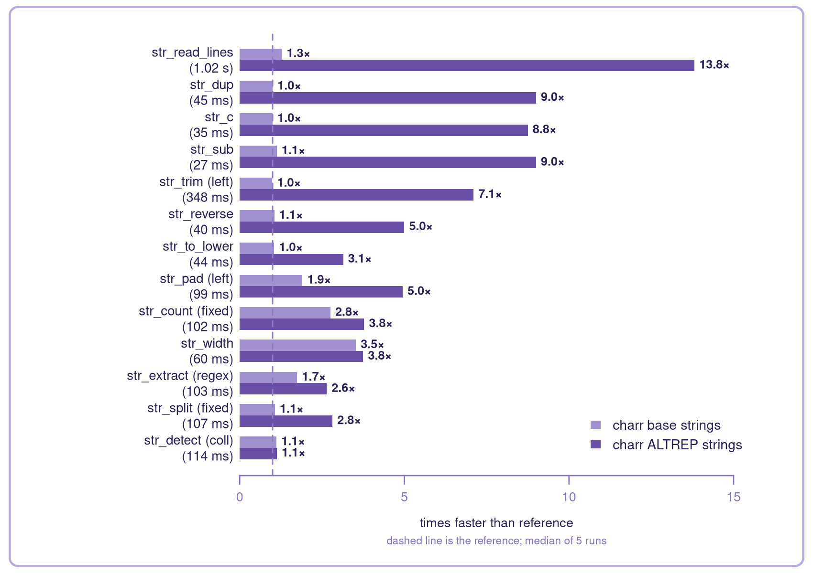

# charr




<a href="https://github.com/charport/charr/actions"></a>

## charr: string processing reimagined for ALTREP strings

`charr` is a fork of `stringr` API and `stringi` backend reimagined for
ALTREP strings. The functions and semantics are the same as `stringr`
but everything is optimized around ALTREP.

ALTREP is R’s mechanism for letting a vector define its own layout, and
many packages already use it internally to store data more efficiently.
For string data, the right layout is worth a lot: order-of-magnitude
performance improvements are possible.

`charr` reimplements `stringr`’s entire API and provides three different
backends: the `stringi` reference, an optimized `base` implementation
that returns ordinary character vectors, and the default `altrep`
implementation that returns ALTREP strings. The three backends are
semantically interchangeable but on average the ALTREP backend can be
much faster.

*This work is supported by the R Consortium Infrastructure Steering
Committee, under the grant Universal ALTREP Interoperability for
Strings.*

## Benchmark

The figure below shows thirteen representative operations measured on a
multilingual [Tatoeba](https://tatoeba.org/) corpus, from 1,000,000
records for the cheapest operations down to 10,000 for the most
expensive. Each bar is the median of five runs, each in a fresh R
process, and its length is how many times faster `charr` is than the
reference.



`str_read_lines()` leads at 13.8×: a second of work becomes 72 ms. Below
it the ordering follows how much of each operation’s time goes into
producing strings rather than inspecting them. `str_detect()` with
collation sits at the bottom at 1.1×; it returns `TRUE`/`FALSE`, so
there is no string output to improve on.

This is a sample rather than the whole surface. [Under the
hood](https://charport.github.io/charr/articles/under-the-hood.html) has
the complete record: all 67 operations, grouped by family.

## Choosing a backend

`charr` picks a backend before a public call starts. The default is
`altrep`:

``` r
charr_backend()                 # returns current value, default "altrep"
prev <- charr_backend("base")    # switch to ordinary character vectors, store previous value
charr_backend("stringi")        # switch to the original stringr implementation
```

Under `altrep`, passing one `charr` call’s output into the next keeps
the data in ALTREP form the whole way; nothing materializes until
something outside `charr` asks for ordinary strings.

`base` runs the same optimized code but writes ordinary character
vectors. `stringi` is the reference, also used directly by `stringr`.

The `charr_backend` selection is stored as an option so you can retrieve
it with `getOption("charr_backend")`.

## Additional functions

`charr` includes a few functions `stringr` does not have, and more may
be added over time.

- `str_reverse()` reverses each string by Unicode code point
- `str_read_lines()` reads a file, converts it to UTF-8, and splits it
  at Unicode line boundaries. It is the fastest way to get text into
  `charr`

## See also

- [Under the
  hood](https://charport.github.io/charr/articles/under-the-hood.html):
  the three backends, the ICU and C++ choices, and the full
  per-operation benchmark.
- [charport](https://charport.github.io/charport/): the ALTREP string
  interoperability layer `charr` is built on.
