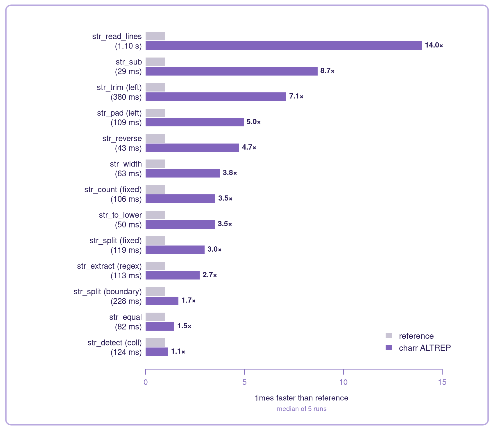

::: {.content-visible when-format="gfm"}
<a href="https://github.com/charbase/charr/actions"></a>
:::

**String processing reimagined for ALTREP strings**

`charr` is an experimental fork of `stringr`. The functions and semantics are the same but everything is optimized around ALTREP strings (custom high-performance string storage), allowing for faster and more efficient operation.

`charr` reimplements `stringr`'s API and provides three different backends: the reference implementation from `stringr`, an optimized `base` implementation using ordinary strings, and the default `altrep` implementation that returns ALTREP strings. The three backends are semantically interchangeable.

*This work is supported by the R Consortium Infrastructure Steering Committee, under the grant Universal ALTREP Interoperability for Strings.*

::: {.content-visible when-format="gfm"}
## Installation

Install `charr` from CRAN:

``` r
install.packages("charr")
```
:::

## Benchmark

The figure below compares `charr`'s default setup, the ALTREP backend on a single thread, with the reference backend. It covers thirteen representative operations from across the package, measured on a multilingual [Tatoeba](https://tatoeba.org/) dataset. Each bar is the median of five runs and its length is how many times faster `charr` is than the reference.

::: {.content-visible when-format="gfm"}

:::

::: {.content-visible when-format="html"}

:::

The speedup comes from two things: ALTREP strings avoid much of the overhead of R string storage, and the string operations themselves are rewritten in optimized C++. Most operations can also split their work across threads with `charr_threads()`, which speeds them up further on large inputs.

::: {.content-visible when-format="gfm"}
[Under the hood](https://charbase.github.io/charr/articles/under-the-hood.html) has the complete benchmark record across all `stringr` operations.
:::

::: {.content-visible when-format="html"}
[Under the hood](under-the-hood.html) has the complete benchmark record across all `stringr` operations.
:::

## Choosing a backend

`charr_backend` gets and sets the way strings are processed for all operations. The default is `altrep`:

``` r
charr_backend()                  # returns current value, default "altrep"
prev <- charr_backend("base")    # Optimized functions using ordinary strings
charr_backend("reference")       # Original stringr reference
```

Under `altrep`, passing one `charr` call's output into the next keeps the data in ALTREP form the whole way; nothing materializes until something outside `charr` asks for ordinary strings.

The `charr_backend` selection is stored as an option so you can retrieve it with `getOption("charr_backend")`.

## Additional functions

`charr` includes a few functions `stringr` does not have, and more may be added over time.

- `str_reverse()` reverses each string by Unicode code point
- `str_read_lines()` reads a file, converts it to UTF-8, and splits it at Unicode line boundaries. It is the fastest way to get text into `charr`
- `str_write_lines()` writes each string as a line to a file, converting it to the requested encoding. It is the counterpart of `str_read_lines()`

## See also

::: {.content-visible when-format="gfm"}
- [Under the hood](https://charbase.github.io/charr/articles/under-the-hood.html): the three backends, the ICU and C++ choices, and the full per-operation benchmark.
- [Code map](https://charbase.github.io/charr/code-map/): an interactive view of the native source graph, generated from Clang's semantic model.
- [charport](https://charbase.github.io/charport/): the ALTREP string interoperability layer `charr` is built on.
:::

::: {.content-visible when-format="html"}
- [Under the hood](under-the-hood.html): the three backends, the ICU and C++ choices, and the full per-operation benchmark.
- [charport](https://charbase.github.io/charport/): the ALTREP string interoperability layer `charr` is built on.
:::