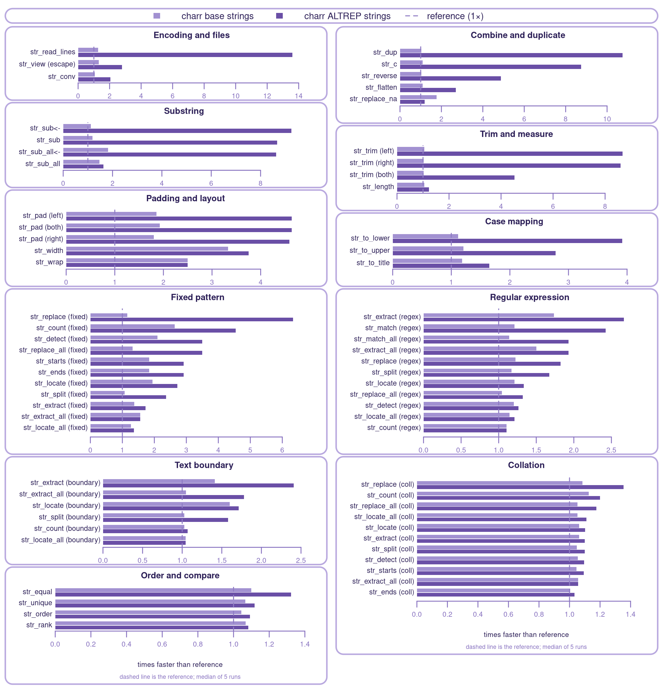

## Three backends

`charr` contains three complete implementations of the `stringr` surface, and chooses between them before a function call starts.

| Backend   | Native code                     | Returns                    |
|-----------|---------------------------------|----------------------------|
| `stringi` | none; calls installed `stringi` | ordinary character vectors |
| `base`    | `charr`'s own C++               | ordinary character vectors |
| `altrep`  | `charr`'s own C++               | ALTREP vectors (default)   |

The `stringi` backend is the original `stringr` implementation, kept unchanged so there is always a reference to compare against. A call to installed `stringi` is never part of the other two.

`base` and `altrep` are separate implementations rather than one implementation with a switch at the end. Each uses its own R and C++ call shapes, because the shape of the output decides what the fastest input handling is: a backend writing into ALTREP blocks wants different buffering from one handing `CHARSXP` pointers to R. Keeping them separate also makes the benchmark easier to read, since the distance between them is the cost of the representation alone.

Behavior is the part they cannot differ on. Values, missingness, recycling, output shape, meaningful attributes, encoding marks, and which invalid inputs raise a warning or error are the same across all three.

## ICU and C++17

ICU (International Components for Unicode) is the low-level C++ library that processes Unicode string data.

`charr` uses system ICU for 78.2 and 78.3. If neither of those version are installed, the configure script selects the bundled ICU 78.3 statically linked with every ICU C symbol suffixed `_78_charr` so it doesn't collide with the ICU inside `stringi` or any other loaded package.

`CHARR_SYSTEM_ICU=yes` or `no` forces either side; unset, `configure` auto-detects and falls back to the bundle. Windows always uses the bundle.

ICU 78 requires C++17, so `charr` compiles as C++17 in order to use the most recent version. `stringi` is a C++11 package and uses ICU 74.1 whenever the system ICU is 75 or newer. The change in ICU version introduces some minor differences.

Emoji are the easiest place to see it. 🫩 (U+1FAE9 face with bags under eyes) was added in Unicode 16.0, so ICU 78 knows what it is and ICU 74.1 treats it as an unassigned code point.

``` r
str_width("🫩")
#> stringi backend (ICU 74.1): 1
#> base and altrep (ICU 78):   2

str_detect("🫩", regex("\\p{Emoji}"))
#> stringi backend (ICU 74.1): FALSE
#> base and altrep (ICU 78):   TRUE

str_sort(c("🫩", "apple", "zebra"))
#> stringi backend (ICU 74.1): "apple" "zebra" "🫩"
#> base and altrep (ICU 78):   "🫩" "apple" "zebra"
```

Two is the correct width. `str_width()` reports how many columns a string takes in a monospaced terminal, and Unicode classifies emoji as double width.

More generally, the main change from ICU 74.1 to 78 is Unicode itself. ICU 74.1 implements Unicode 15.1 and ICU 78 implements Unicode 17.0, so the two optimized backends support newer Unicode changes. For example, Unicode 16.0 adds seven scripts on its own, among them Garay, an alphabet devised in Senegal in the 1960s.

## Extended benchmarks

The benchmark scripts are in `inst/extra/benchmark`.

The corpus is multilingual sentences from [Tatoeba](https://tatoeba.org/), sampled in 1,000,000, 100,000 and 10,000 sizes. Each prefix exists twice, once as an ordinary character vector and once as a `charvec`, an optimized ALTREP class (see [charport](https://charbase.github.io/charport/)).

To comprehensively evaluate `charr`, the benchmark exercises 67 operations across the entire `stringr` function surface. Each measurement is one operation in a fresh R process. Each condition gets five repetitions and the reported figure is the median.

Three of the query patterns are first derived from the corpus before benchmarks are run:

- Fixed patterns search for the most common word per language in the dataset
- Collation patterns test case-invariance, by searching for uppercase versions of words in the same text
- Re-encoding performance is tested by generating selected sentences in legacy character sets (Windows-1252, ISO-8859-2, Shift_JIS) and benchmarking conversion back to UTF-8

Each panel below is a family of operations, a grouping of operations that do similar work, either producing the same kind of output or using the same patterns.

Bars are how many times faster `charr` is than the reference on the same input, and the dashed line is the reference.



ALTREP is faster than the reference on all 67 operations, with medians from 1.05× to 13.8×. Base medians run from 0.98× to 3.53×. The four operations where base sits below 1.00× are `str_equal` and the three trims, all within a run-to-run spread of the reference rather than behind it.

Measured on Linux, R 4.6.1, GCC with `-O2`, `charr` on system ICU 78.2.

## References

`charr` incorporates and builds off of three impressive external packages:

- stringr 1.6.0.9000, forked, [tidyverse/stringr](https://github.com/tidyverse/stringr) at `ae054b1d28f630fee22ddb3cb7525396e62af4fe` (2025-11-04)
- stringi 1.8.9, forked, [gagolews/stringi](https://github.com/gagolews/stringi) at `68fe9b91cee2ca959d72a75660add028531d6af1` (2026-07-30)
- ICU4C 78.3, bundled, `icu4c-78.3-sources.tgz` from the official [release archive](https://github.com/unicode-org/icu/releases/tag/release-78.3)