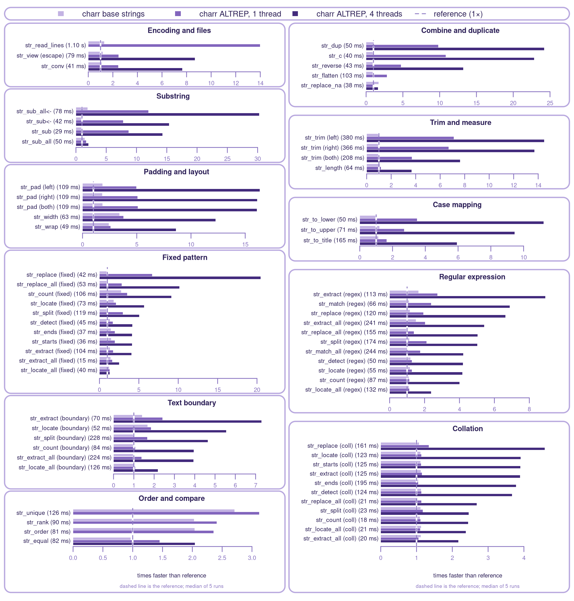

## charr backend

`charr` contains three complete implementations of the `stringr` API.

| Backend | Implementation | Returns |
|-----------------|----------------------------|---------------------------|
| `reference` | Calls `stringi` / `stringr` | ordinary character vectors |
| `base` | `charr`'s own optimized C++ with base strings | ordinary character vectors |
| `altrep` (default) | `charr`'s own optimized C++ with ALTREP strings | ALTREP vectors |

The `reference` backend is the original `stringr` implementation, kept unchanged so there is always a reference to compare against.

`base` and `altrep` are separate implementations. Each uses its own R and C++ functions, because ALTREP storage has a different shape which changes the best way to process the data.

All three backends are semantically equivalent and produce the same behavior except for a small nuance noted below.

## ICU and C++17

ICU (International Components for Unicode) is the low-level C++ library that processes Unicode string data.

`charr` uses system ICU for 78.2 and 78.3. If neither of those versions are installed, the configure script selects the bundled ICU 78.3 statically linked with every ICU C symbol suffixed `_78_charr` so it doesn't collide with the ICU inside `stringi` or any other loaded package.

`CHARR_SYSTEM_ICU=yes` or `no` forces either side; unset, `configure` auto-detects and falls back to the bundle. Windows always uses the bundle.

ICU 78 requires C++17, and `charr` compiles as C++17 so it can always use a current ICU: the system ICU 78.2 or 78.3 when present, and its bundled ICU 78.3 otherwise. At the time of writing, `stringi` (version 1.8.9) uses the system ICU when one is installed and otherwise its bundled ICU 74.1, which is always the case on Windows. When the two packages end up on different ICU versions, results can differ slightly.

Emoji are the easiest place to see it. 🫩 (U+1FAE9 face with bags under eyes) was added in Unicode 16.0, so ICU 78 knows what it is and ICU 74.1 treats it as an unassigned code point. With the reference on its bundled ICU 74.1:

``` r
str_width("🫩")
#> reference (ICU 74.1):     1
#> base and altrep (ICU 78): 2

str_detect("🫩", regex("\\p{Emoji}"))
#> reference (ICU 74.1):     FALSE
#> base and altrep (ICU 78): TRUE

str_sort(c("🫩", "apple", "zebra"))
#> reference (ICU 74.1):     "apple" "zebra" "🫩"
#> base and altrep (ICU 78): "🫩" "apple" "zebra"
```

Two is the correct width. `str_width()` reports how many columns a string takes in a monospaced terminal, and Unicode classifies emoji as double width.

More generally, the main change from ICU 74.1 to 78 is Unicode itself. ICU 74.1 implements Unicode 15.1 and ICU 78 implements Unicode 17.0, so the two optimized backends support newer Unicode changes. For example, Unicode 16.0 adds seven scripts on its own, among them Garay, an alphabet devised in Senegal in the 1960s.

## Extended benchmarks

The corpus is multilingual sentences from [Tatoeba](https://tatoeba.org/), sampled in 1,000,000, 100,000 and 10,000 sizes. Each sample is used twice: once as an ordinary character vector and once as a `charvec`, an optimized ALTREP class (see [charport](https://charbase.github.io/charport/)).

To comprehensively evaluate `charr`, the benchmark exercises 67 operations across the entire `stringr` API. Each measurement is one operation in a fresh R process. Each condition gets five repetitions and the reported figure is the median.

Three of the query patterns are first derived from the corpus before benchmarks are run:

- Fixed patterns search for the most common word per language in the dataset
- Collation patterns test case-invariance, by searching for uppercase versions of words in the same text
- Re-encoding performance is tested by generating selected sentences in legacy character sets (Windows-1252, ISO-8859-2, Shift_JIS) and benchmarking conversion back to UTF-8

Each panel below is a family of operations, a grouping of operations that do similar work, either producing the same kind of output or using the same patterns.

Bars are how many times faster `charr` is than the reference on the same input, and the dashed line is the reference.



## References

`charr` incorporates and builds off of three impressive external packages:

- stringr 1.6.0.9000, forked, [tidyverse/stringr](https://github.com/tidyverse/stringr) at `ae054b1d28f630fee22ddb3cb7525396e62af4fe` (2025-11-04)
- stringi 1.8.9, forked, [gagolews/stringi](https://github.com/gagolews/stringi) at `68fe9b91cee2ca959d72a75660add028531d6af1` (2026-07-30)
- ICU4C 78.3, bundled, `icu4c-78.3-sources.tgz` from the official [release archive](https://github.com/unicode-org/icu/releases/tag/release-78.3)

`charr`'s own code and the parts derived from `stringr` are MIT licensed. Code adapted from `stringi` is under its BSD 3-Clause License, and the bundled ICU source and data under the Unicode License v3. `LICENSE.note` in the source package explains which parts fall under which license, and the installed `COPYRIGHTS` file carries the full notices.